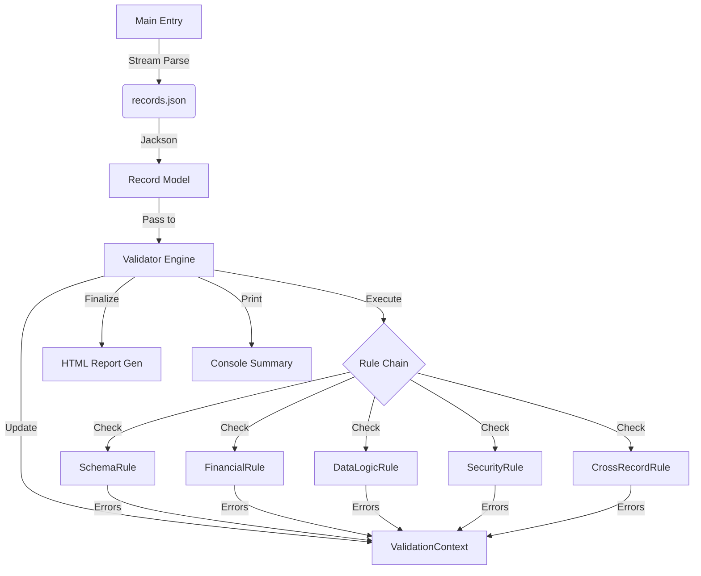

# Java Records Validator - Project Summary

## 1. Technology Stack
- **Language**: Java 17 (Recommended) / 11+ Compatible
- **Build Tool**: Maven 3.x
- **Libraries**:
  - `jackson-databind` (JSON Parsing)
  - `slf4j-simple` (Logging)
  - `chart.js` (Frontend Reporting - CDN)

## 2. Prerequisites
- **Java JDK**: Version 17 or higher installed and configured in `PATH`.
- **Maven**: Version 3.6+ installed and configured.
- **Internet Access**: Required for downloading Maven dependencies and rendering Chart.js in the HTML report.

## 3. Project Architecture

The project follows a **Modular Validation Engine** architecture. It decouples the data parsing (`Main`) from the validation logic (`Validator`), and breaks down validation logic into specific `Rule` classes.

### Data Flow Diagram



### Key Components
- **Main**: Application entry point. Handles file I/O and JSON streaming.
- **Validator**: orchestration engine. Manages the `ValidationContext` and executes rules.
- **ValidationContext**: Stateful object tracking global metrics (total, invalid), cross-record data (seen IDs), and error aggregations.
- **Rules**: Independent logic units implementing `ValidationRule` interface.
  - `SchemaRule`: Checks for mandatory fields and unknown attributes (schema drift).
  - `FinancialRule`: Validates totals, negative values, and outliers.
  - `SecurityRule`: Detection of XSS patterns and high-risk currencies.

## 4. Directory Structure

```
d:/Qualys/validator/
├── pom.xml                     # Maven dependencies
├── run_validation.bat          # Execution script
├── .gitignore                  # Git configuration
├── src/
│   └── main/java/com/qualys/validator/
│       ├── Main.java           # Entry Point
│       ├── Validator.java      # Reporting & Orchestration
│       ├── CsvExporter.java    # CSV Utility
│       ├── engine/             # Core Framework
│       │   ├── ValidationContext.java
│       │   ├── ValidationResult.java
│       │   ├── ValidationError.java
│       │   └── ValidationRule.java
│       ├── rules/              # Business Logic
│       │   ├── SchemaRule.java
│       │   ├── FinancialRule.java
│       │   ├── DataLogicRule.java
│       │   ├── SecurityRule.java
│       │   └── CrossRecordRule.java
│       └── model/              # Data POJOs
│           ├── Record.java
│           ├── Item.java
│           ├── Discount.java
│           └── Metadata.java
```

## 5. Code Walkthrough
- **`model/Record.java`**: Maps the JSON structure. Uses `@JsonAnySetter` to capture "Schema Drift" (unknown fields).
- **`engine/ValidationRule.java`**: Interface ensuring all rules follow the `validate(record, context, result)` signature.
- **`rules/SecurityRule.java`**: Scans string fields for SQLi/XSS patterns (e.g., `<script>`, `DROP TABLE`) and flags risky currencies like `BTC` or `XXX`.
- **`Validator.java`**: 
  - Initializes the rule chain.
  - Generates the **HTML Dashboard** using internal StringBuilder logic.
  - Embeds CSS/JS for the report.

## 6. How to Run

### Step 1: Build the Project
Open a terminal in `d:\Qualys\validator` and run:
```bash
mvn clean package
```
*This creates the executable JAR in the `target/` directory.*

### Step 2: Execute Validation
Run the provided batch script:
```bash
run_validation.bat
```
*This runs the validator against `d:\Qualys\records.json`.*

### Step 3: Export to CSV (Optional)
To convert the JSON to a flattened CSV:
```bash
run_validation.bat --csv
```
*(Or modify the script to pass `--csv` as an argument)*

## 7. Reading the HTML Report

Open **`validation_report.html`** in any modern web browser.

### **Dashboard Sections:**
1.  **KPI Cards**: 
    - **Quality Score**: Percentage of valid records.
    - **Security Score**: Weighted score based on severity of errors (100 = Perfect).
2.  **Risk Insights**: Yellow box highlighting critical findings (e.g., "Financial Integrity Issues detected").
3.  **Visualizations**:
    - **Category Chart**: Doughnut chart showing distribution of error types (Financial vs Schema vs Security).
    - **Severity Chart**: Bar chart showing High/Medium/Low priority issues.
4.  **Detailed Diagnostics**:
    - Collapsible sections for each category.
    - Click **"Schema Issues"** or **"Security Issues"** to expand the list.
    - The table shows the exact Line Number and Severity of each error.
